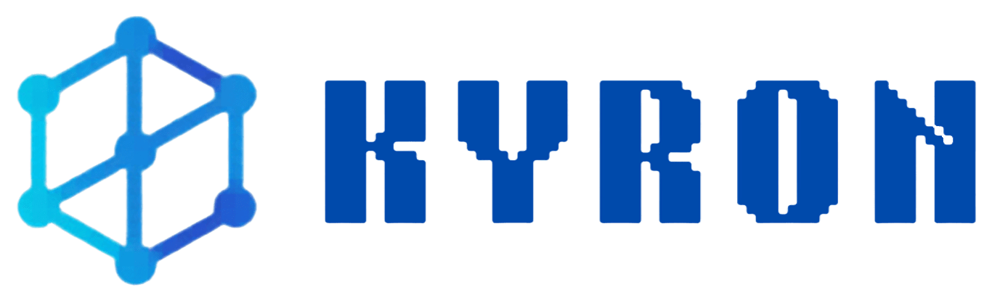
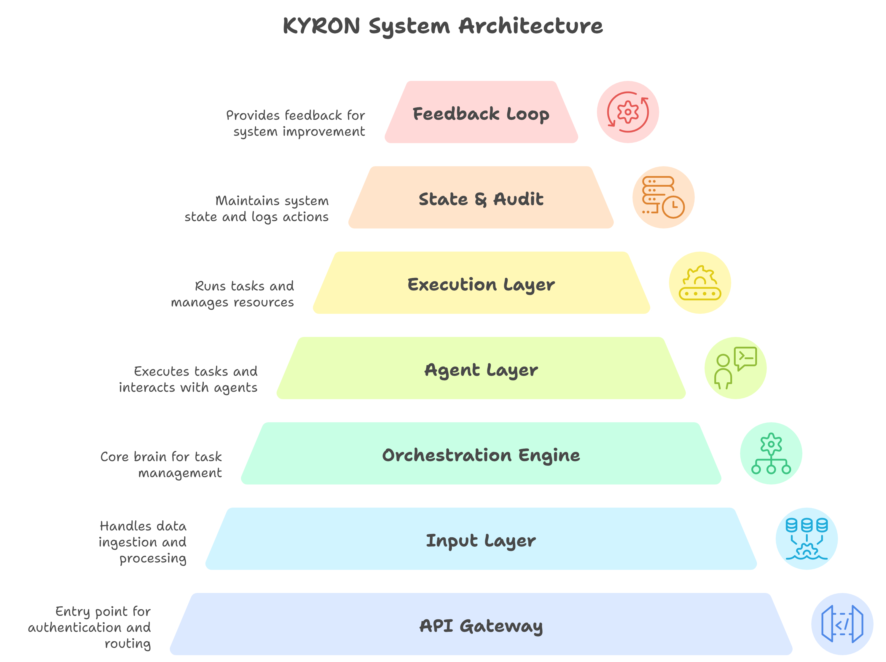

  

---

<b>Autonomous Execution Engine</b>

Execution is the biggest bottleneck in organizations. 
KYRON removes that bottleneck by taking ownership of execution itself.

  
  
  

---

## Overview

KYRON is an autonomous system that executes work inside organizations.

It does not assist users.  
It does not automate isolated tasks.  

It owns execution end-to-end.

Given a goal, KYRON:
- plans execution  
- assigns tasks  
- communicates with stakeholders  
- tracks progress  
- detects failures  
- self-corrects  
- ensures completion  

---

## The Problem

Execution inside organizations is unreliable:

- Plans are created but not executed properly  
- Tasks are assigned but not followed up  
- Deadlines are missed  
- Managers spend time chasing updates  

Execution today is:
- manual  
- fragmented  
- dependent on human coordination  

---

## The Solution

KYRON introduces a new approach:

> Execution-as-a-System

Instead of managing work, it ensures work gets done.

---

## Execution Flow

Goal → Plan → Assign → Execute → Monitor → Fix → Complete

---

## How It Works

1. Goal Input  
   Manager defines a goal (e.g., launch campaign)

2. Planning  
   System breaks goal into structured tasks

3. Assignment  
   Tasks assigned based on skills, role, and performance

4. Execution  
   Communicates via Email, WhatsApp, Slack

5. Monitoring  
   Tracks progress continuously

6. Recovery  
   Detects delays and self-corrects

7. Completion  
   Ensures goal is achieved

---

## System Architecture

  

View Architecture Layers

- API Gateway — authentication and routing  
- Input Layer — goal ingestion  
- Orchestration Engine — execution control  
- Agent System — planning, assignment, monitoring  
- Execution Layer — humans and external tools  
- State and Memory Layer — tasks, logs, company data  

---

## Agent System

KYRON operates through specialized agents:

- Planning Agent  
- Assignment Agent  
- Communication Agent  
- Monitoring Agent  
- Recovery Agent  
- Audit Agent  

These agents work together to enable continuous execution.

---

## Use cases

  

---

## Why KYRON

| Traditional Tools | KYRON |
|------------------|------|
| Assist users | Executes work |
| Static workflows | Dynamic execution |
| Manual follow-ups | Automatic follow-ups |
| No failure handling | Self-correcting |
| Fragmented tools | Unified system |

Others help you work. KYRON gets the work done.

---

## Impact

KYRON enables organizations to:

- eliminate coordination overhead  
- reduce execution delays  
- improve execution reliability  
- scale without increasing management layers  

Work moves from being managed to being executed.

---

## Downloads

You can download the web and mobile app directly from our official webpage :

---

## Authentication

- JWT-based authentication  
- Role-based access  
- Secure API handling  

---

## Vision

Work should not be managed.  
Work should execute itself.

---

## Contact

- Email: bhaveshgudlani716@gmail.com
- LinkedIn: https://www.linkedin.com/in/bhaveshgudlani/
